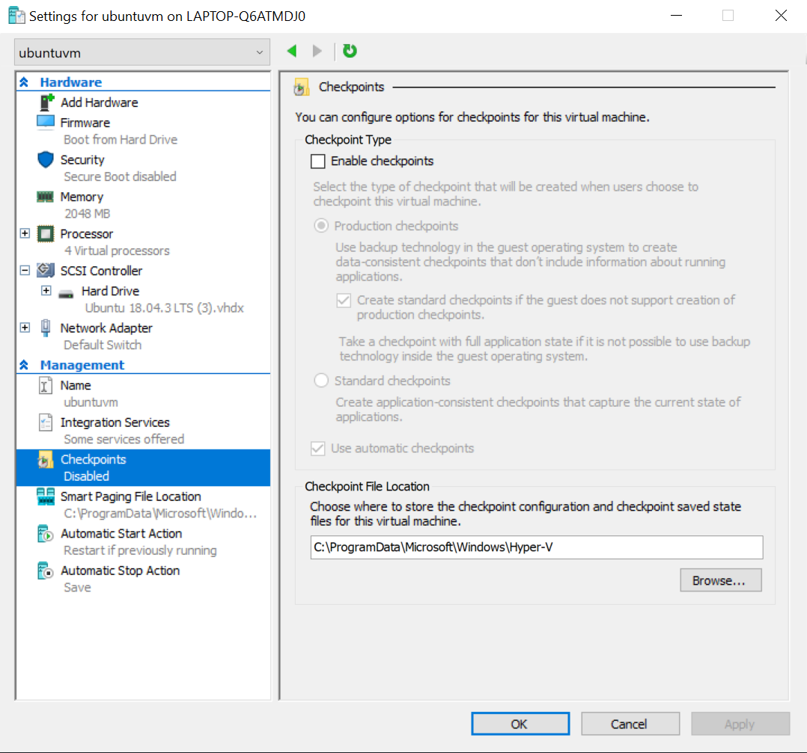

## Install Hyper V on Windows 10

Author: Alexander Uzikov
Based on this [link](https://docs.microsoft.com/en-us/virtualization/hyper-v-on-windows/quick-start/enable-hyper-v)

Enable Hyper-V to create virtual machines on Windows 10.
Hyper-V can be enabled in many ways including using the Windows 10 control panel, PowerShell or using the Deployment Imaging Servicing and Management tool (DISM). This documents walks through PowerShell option, others can by found on the link above.

__Note__: Hyper-V is built into Windows as an optional feature -- there is no Hyper-V download.

__Check Requirements__:

* Windows 10 Enterprise, Pro, or Education
* 64-bit Processor with Second Level Address Translation (SLAT).
* CPU support for VM Monitor Mode Extension (VT-c on Intel CPUs).
* Minimum of 4 GB memory.
* The Hyper-V role cannot be installed on Windows 10 Home.

Upgrade from Windows 10 Home edition to Windows 10 Pro by opening up Settings > Update and Security > Activation.

For more information and troubleshooting, see [Windows 10 Hyper-V System Requirements](https://docs.microsoft.com/en-us/virtualization/hyper-v-on-windows/reference/hyper-v-requirements).

__Enable Hyper-V using PowerShell__:
1. Open a PowerShell console as Administrator.
2. Run the following command:
`
Enable-WindowsOptionalFeature -Online -FeatureName Microsoft-Hyper-V -All
`

If the command couldn't be found, make sure you're running PowerShell as Administrator.

When the installation has completed, reboot.

## Creation of VM
based on this [link](https://docs.microsoft.com/en-us/virtualization/hyper-v-on-windows/quick-start/quick-create-virtual-machine#windows-10-fall-creators-update-windows-10-version-1709)

Create a virtual machine and install its operating system.

Instructions are given for Windows 10 Fall Creators Update (v1709) and later. If your version is earlier, you have to update it or use instructions given in the link above.

Let's get started.

To create a new virtual machine in Fall Creators Update:

1. Open Hyper-V Quick Create from the start menu. 
2. Select an operating system or choose your own by using a local installation source, after click Create Virtual Machine. 

__If you want to use your own image to create the virtual machine:__
1. Select Local Installation Source.
2. Select Change Installation Source. 
3. Pick the .iso or .vhdx that you want to turn into a new virtual machine.
4. If the image is a Linux image, deselect the Secure Boot option. 
5. Select "Create Virtual Machine"

That's it! Quick Create will take care of the rest.

## First run of Ubuntu
1. Open Hyper-V Manager 
2. (optional) Rename your VM. By default it has the name of operation system you installed. I renamed it to ubuntuvm and will use this name everywhere below. 
3. Click button "Start" in the drop-down menu.

Now you have to go through the the normal installing of Ubuntu.

__Take into account two bugs:__
1. You MUST choose an option "require my password to log in". Otherwise VM will not work properly
2. If your keyboard supports not only latin letters, but also other alphabets, it is better to choose that you have only a latin keyboard. Otherwise you may face problems with connection to VM.

__Here is the description of installation process:__
1. Choose English.
2. Choose keyboard layout that uses only latin, so English or German are good.
3. Choose Timezone.
4. Choose name, computer name, username and password.
5. Wait for the end of installation.

## Installation of SGX Driver
Press Ctrl+Alt+T to open a Terminal and execute the following commands:
```bash
sudo apt-get update
sudo apt install curl
sudo apt install git
sudo curl -fssl https://raw.githubusercontent.com/SconeDocs/SH/master/install_sgx_driver.sh | bash
```

Know you need to turn off the virtual machine and turn off checkpoints in the setings of VM.



Now you need to configure your VM to use SGX.
Open Microsoft PowerShell(x86) as an administrator and run the following configuration code:

```bash
#based on https://blogs.msdn.microsoft.com/taylorb/2013/11/08/memory-configuration-utilizing-the-hyper-v-wmi-v2-namespace/

Param(
    [Parameter(Mandatory=$true)] $vmName
)

$ErrorActionPreference = 'Stop'
$sgxsize = 90

#Retrieve the Hyper-V Management Service, ComputerSystem class for the VM and the VM’s SettingData class.
$Msvm_VirtualSystemManagementService = Get-WmiObject -Namespace root\virtualization\v2 -Class Msvm_VirtualSystemManagementService

$Msvm_ComputerSystem = Get-WmiObject -Namespace root\virtualization\v2 -Class Msvm_ComputerSystem -Filter "ElementName='$vmName'"
If (-not $Msvm_ComputerSystem) { Throw "VM '$vmName' not found" }

$Msvm_VirtualSystemSettingData = ($Msvm_ComputerSystem.GetRelated("Msvm_VirtualSystemSettingData", `
    "Msvm_SettingsDefineState", `
    $null, `
    $null, `
    "SettingData", `
    "ManagedElement", `
    $false, $null) | % {$_})

#Retrieve the Msvm_MemorySettingData Associated to the VM.
$Msvm_MemorySettingData = ($Msvm_VirtualSystemSettingData.GetRelated( "Msvm_MemorySettingData") | % {$_})

#Enable SGX
$Msvm_MemorySettingData.SgxSize = $sgxsize
$Msvm_MemorySettingData.SgxEnabled = $true

#First apply the Virtual NUMA changes then Apply The Memory Changes
[void]$Msvm_VirtualSystemManagementService.ModifySystemSettings($Msvm_VirtualSystemSettingData.GetText(2))
[void]$Msvm_VirtualSystemManagementService.ModifyResourceSettings($Msvm_MemorySettingData.GetText(2))

#Verify the changes
$Msvm_MemorySettingData = ($Msvm_VirtualSystemSettingData.GetRelated( "Msvm_MemorySettingData") | % {$_})
if (-not $Msvm_MemorySettingData.SgxEnabled -or $Msvm_MemorySettingData.SgxSize -ne $sgxsize) { Throw 'Failed to enable SGX' }

'OK'
```

Now you can turn of the VM and check that everything is OK using the command below:

```bash
ls /dev/isgx >/dev/null 2>1  && echo "SGX Driver installed" || echo "SGX Driver NOT installed"
```

## Installation of Docker Community
based on this [link](https://docs.docker.com/install/linux/docker-ce/ubuntu/)

To get started with Docker Engine - Community on Ubuntu, make sure you meet the prerequisites, then install Docker.

 __Prerequisites:__

__OS requirements:__
To install Docker Engine - Community, you need the 64-bit version of one of these Ubuntu versions:

* Disco 19.04
* Cosmic 18.10
* Bionic 18.04 (LTS)
* Xenial 16.04 (LTS)

Docker Engine - Community is supported on __x86_64__ (or __amd64__), __armhf__, __arm64__, __s390x__ (IBM Z), and __ppc64le__ (IBM Power) architectures.

__Uninstall old versions:__

Older versions of Docker were called docker, docker.io , or docker-engine. If these are installed, uninstall them:

```bash
sudo apt-get remove docker docker-engine docker.io containerd runc
```
It’s OK if apt-get reports that none of these packages are installed.

The contents of __/var/lib/docker/__, including images, containers, volumes, and networks, are preserved. The Docker Engine - Community package is now called docker-ce.

__Install using the repository:__
Before you install Docker Engine - Community for the first time on a new host machine, you need to set up the Docker repository. Afterward, you can install and update Docker from the repository.

__SET UP THE REPOSITORY:__
1. Update the apt package index:
```bash
sudo apt-get update
```
2. Install packages to allow apt to use a repository over HTTPS:
```bash
sudo apt-get install \
    apt-transport-https \
    ca-certificates \
    curl \
    gnupg-agent \
    software-properties-common

```

3. Add Docker’s official GPG key:
```bash
curl -fsSL https://download.docker.com/linux/ubuntu/gpg | sudo apt-key add -
```
Verify that you now have the key with the fingerprint 9DC8 5822 9FC7 DD38 854A E2D8 8D81 803C 0EBF CD88, by searching for the last 8 characters of the fingerprint.
```bash
sudo apt-key fingerprint 0EBFCD88
```
4. (for __x86_64__ or __amd64__, other options can be found via link above) installing the stable version of docker repository.
```bash
    sudo add-apt-repository \
   "deb [arch=amd64] https://download.docker.com/linux/ubuntu \
   $(lsb_release -cs) \
   stable"
```

__INSTALL DOCKER ENGINE - COMMUNITY:__
1. Update the apt package index.
```bash
sudo apt-get update
```
2. Install the latest version of Docker Engine - Community and containerd. Instructions for installing specific versions can be found via [link](https://docs.docker.com/install/linux/docker-ce/ubuntu/#install-docker-engine---community-1).
```bash
sudo apt-get install docker-ce docker-ce-cli containerd.io
```
3.Verify that Docker Engine - Community is installed correctly by running the __hello-world__ image.
```bash
sudo docker run hello-world
```

## Installation of Alpine linux
1. Download Alpine Linux from official [website](https://alpinelinux.org/downloads/). I downloaded a standard version.
2. Open Hyper V Quick Create, choose .iso with Alpine and choose options like on the screen.


3. Start the system. Write root as a login with no password.


4. Congratulations!

## Installation of SCONE
It is recommended to use Alpine Linux for container images using SCONE and Ubuntu 16.04 LTS or Ubuntu 18.04 LTS for the hosts that run these container images. To ensure that the Ubuntu host has all software installed to run SCONE containers, you need to run:
```bash
sudo curl -fssl https://raw.githubusercontent.com/scontain/install_dependencies/master/install-host-prerequisites.sh | bash
```
This script will check if the required components are already installed and installs only the components that have not yet been installed.

Now you need to log in with your Docker ID.
```bash
sudo docker login
```
Some containers are private, so you possibly would need te request an access. To do it you have to write on this mail: 	__info@scontain.com__.

## Example: 23 Fibonacci number

1. Ensure that you have the newest SCONE cross compiler image:
 ```bash
docker pull sconecuratedimages/crosscompilers
docker run --device=/dev/isgx -it sconecuratedimages/crosscompilers
 ```
 Drop argument --device=/dev/isgx in case you do not have an SGX driver installed.

2. Create file with C code.
```C
cat > fib.c << EOF
#include <stdio.h>
#include <stdlib.h>
int main(int argc, char** argv) {
   int n=0, first = 0, second = 1, next = 0, c;

   if (argc > 1)
        n=atoi(argv[1]);
   printf("fib(%d)= 1",n);
   for ( c = 1 ; c < n ; c++ ) {
        next = first + second;
        first = second;
        second = next;
        printf(", %d",next);
   }
   printf("\n");
}
EOF
```
3. Compile the program with scone gcc or scone-gcc or just gcc (all equivalent):
```bash
scone gcc fib.c -o fib
```
4. To compute fib(23), execute:
 ```bash
 SCONE_VERSION=1 ./fib 23
 ```
